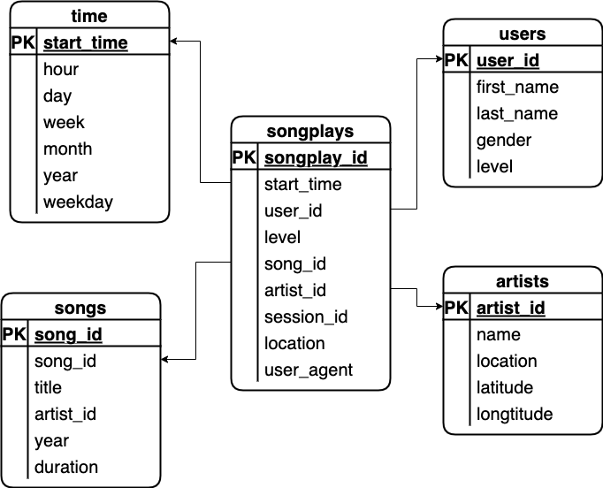
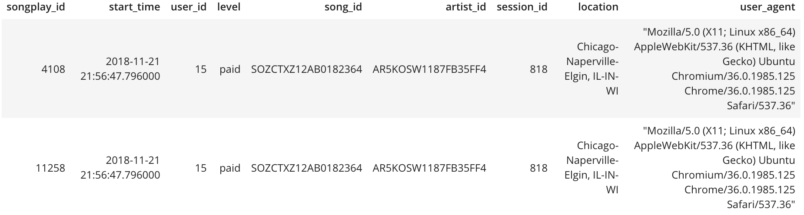

# 1/About Sparkify
A startup called Sparkify wants to analyze the data they've been collecting on songs and user activity on their new music streaming app.

# 2/The purpose of this project
The analytics team is particularly interested in understanding what songs users are listening to.
Currently, the don't have an easy way to query their data, which resides in a directory of JSON logs on user activity on the app, as well as a directory with JSON metadata on the songs in their app.

They'd like a data engineer to create a Postgres database with tables designed to optimize queries on song play analysis.

# 3/Project description
Creating a database schema that have fact and dimension tables for a start schema and ETL pipeline for this analysis.

# 4/The schema description, fact and dimension tables
- Dimension Table
  - songplays - records in log data associated with song plays i.e. records with page NextSong
    > songplay_id, start_time, user_id, level, song_id, artist_id, session_id, location, user_agent
- Fact Table
  - users - users in the app
    > user_id, first_name, last_name, gender, level
  - songs - songs in music database
    > song_id, title, artist_id, year, duration
  - artists - artists in music database
    > artist_id, name, location, latitude, longitude
  - time - timestamps of records in songplays broken down into specific units
    > start_time, hour, day, week, month, year, weekday
  - Below is the schema of this project


# 5/Guideline for run the scrips of project
### Below are steps you can follow to complete the project:

- Create Tables
1. Write CREATE statements in *sql_queries.py* to create each table.
2. Write DROP statements in *sql_queries.py* to drop each table if it exists.
3. Run *create_tables.py* to create your database and tables.
4. Run *test.ipynb* to confirm the creation of your tables with the correct columns. *Make sure to click "Restart kernel" to close the connection to the database* after running this notebook.

- Build ETL Processes
  - Follow instructions in the *etl.ipynb* notebook to develop ETL processes for each table. At the end of each table section, or at the end of the notebook, run *test.ipynb* to confirm that records were successfully inserted into each table. Remember to rerun *create_tables.py* to reset your tables before each time you run this notebook.

- Build ETL Pipeline
  - Use what you've completed in *etl.ipynb* to complete *etl.py*, where you'll process the entire datasets. Remember to run *create_tables.py* before running *etl.py* to reset your tables. Run *test.ipynb* to confirm your records were successfully inserted into each table.


# 6/Project Template
1. *test.ipynb* displays the first few rows of each table to let you check your database.
2. *create_tables.py* drops and creates your tables. You run this file to reset your tables before each time you run your ETL scripts.
3. *etl.ipynb* reads and processes a single file from *song_data* and *log_data* and loads the data into your tables. This notebook contains detailed instructions on the ETL process for each of the tables.
4. *etl.py* reads and processes files from *song_data* and *log_data* and loads them into your tables. You can fill this out based on your work in the ETL notebook.
5. *sql_queries.py* contains all your sql queries, and is imported into the last three files above.
6. *README.md* provides discussion on your project.


# 7/Example queries and results for song play analysis
  - The query is used to getting the song play
    ```sql
    SELECT songs.song_id, artists.artist_id
    FROM songs JOIN artists ON songs.artist_id = artists.artist_id
    WHERE songs.title = (%s)
          AND artists.name = (%s)
          AND songs.duration = (%s)
          AND songs.song_id IS NOT NULL
          AND artists.artist_id IS NOT NULL
    ```
    
  - Results of above query
  
  
